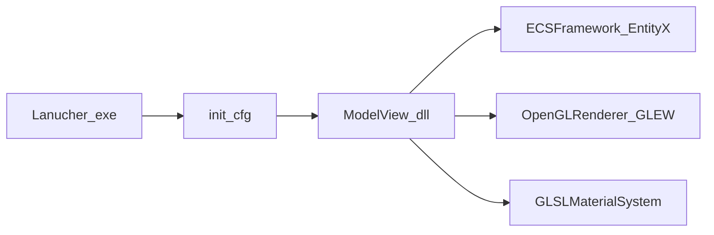

# Platinum Ranger Engine (PlatinumRangerEngine)

**[Traditional Chinese README](README.md)** · English

A Windows sample built around **ECS (EntityX)**. The demo uses **Win32** plus **OpenGL (GLEW)** for rendering. Engine flow and integrations (materials, movement, input, etc.) are largely authored in-house; third-party libraries are used only where needed. Language standard: **C++11**.

## Highlights

- Three pipelines: **Diffuse (forward)**, **Deferred**, and **Physically Based Rendering (PBR)**
- Deferred / PBR: **Bloom** parameters, light-volume drawing, and culling / debug overlays
- PBR only: **Rim light**, specular modes (**Phong** / **Blinn** / **Cook**), and Cook–Torrance microfacet variants
- Diffuse mode: optional **geometry-shader normals** visualization
- **Dear ImGui** integration (see the `ImguiFramework` project in the solution)

## Repository layout (`MainProject.sln`)

| Folder / project | Role |
|------------------|------|
| [Lanucher](Lanucher) | Launcher: loads the main module from config (default `ModelView.dll`). |
| [ModelView](ModelView) | Demo app built as a DLL; wires rendering, input, scene, spawning, etc. |
| [ECSFramework](ECSFramework) | ECS layer over [3rdParty/EntityX](3rdParty/EntityX). |
| [OpenGLRenderer](OpenGLRenderer) | OpenGL backend (GLEW and related glue). |
| [GLMFramework](GLMFramework) | Camera, bounds, math helpers. |
| [GLSLMaterialSystem](GLSLMaterialSystem) | GLSL materials and shader wiring. |
| [ImguiFramework](ImguiFramework) | ImGui rendering and hooks. |
| [VulkanRenderer](VulkanRenderer) | Vulkan renderer is **still under development** and receives **sporadic updates**. Included as a static library / experimental backend. **The runnable demo documented in this README uses the OpenGL path.** |
| [AppProject](AppProject) | Extra samples / tooling (depends on your build configuration). |

## Startup (concept)

## Build and run

1. Open **`MainProject.sln`** with **Visual Studio** (solution format targets an older VS; newer VS may ask to upgrade or retarget the toolset — use whatever builds on your machine).
2. Pick **Win32 / x64** (or equivalent) and build dependencies so **`ModelView` produces `ModelView.dll`**.
3. Set **`Lanucher`** as the startup project (or run the built `Lanucher.exe`).
4. [Lanucher/init.cfg](Lanucher/init.cfg) defaults include `WorkDir="../ModelView"` and `MainModule="ModelView.dll"`. After changing output directories, edit the config so the launcher finds the DLL and the working directory is correct.
5. Default window size is controlled via `ScreenWidth` / `ScreenHeight` in `init.cfg`.

## Demo controls

### Switch render pipeline

| Key | Action |
|-----|--------|
| `O` / `P` / `[` | Cycle Diffuse ↔ Deferred ↔ PBR |

### Shared: Deferred & PBR

| Key | Action |
|-----|--------|
| `I` / `K` | Bloom brightness ± |
| `U` / `J` | Bloom contrast ± |
| `Y` / `H` | Bloom luminance threshold ± |
| `T` / `G` | Bloom blur weight ± |
| `L` | Toggle light-volume rendering |
| `M` | Toggle bloom rendering |
| `N` | Toggle octree bounds (reference for render culling) |
| `B` | Toggle octree culling pass |
| `V` | Toggle object bounding boxes |

### PBR only

| Key | Action |
|-----|--------|
| `R` / `F` | Rim-light parameter ± |
| `X` | Cycle specular path: **Phong** → **Blinn** → **Cook** |
| `Z` | Under Cook: **Cook Blinn** → **Beckmann** → **GGX** |

### Diffuse only

| Key | Action |
|-----|--------|
| `B` | Toggle octree culling pass |
| `V` | Toggle object bounding boxes |
| `]` | Toggle normals drawn via geometry shader |

## Demo

---

## Third-party libraries

Vendored sources live under [`3rdParty/`](3rdParty); what actually links follows each subproject’s `.vcxproj`.

- **OpenGL demo path**: **EntityX** (ECS), **GLM**, **GLEW**, **Assimp** (+ **zlib**), **GLI**, **RapidXML**, **glslang**, **FreeType**, **Dear ImGui**, **NanoLogger**, **pthreads-win32**, `kdTree-master` (spatial headers).
- **Some `ModelView` configurations**: **SFML** and **libjpeg** may appear in project settings depending on platform/config and local paths.
- **`VulkanRenderer` (in development)**: **Vulkan** headers (`3rdParty/vulkan`), **fastCRC**, plus shared use of **GLM**, **GLI**, **glslang**, **EntityX**, etc.

Folders such as **RTTR** or `libbulletml-master` may be unused by the current build. License texts ship inside each dependency directory.

## License

See [LICENSE](LICENSE).
