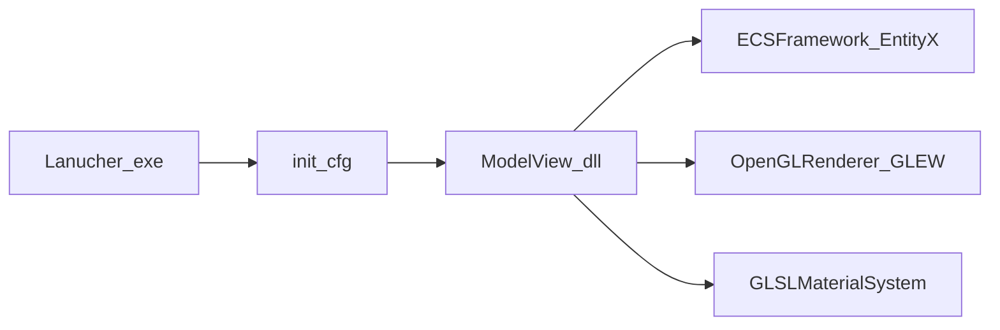

# Platinum Ranger Engine（PlatinumRangerEngine）

**[English](README-en.md)** · 繁體中文

以 **ECS（EntityX）** 為核心的 Windows 示範專案，Demo 繪製使用 **Win32** 視窗 API 搭配 **OpenGL（GLEW）**。引擎邏輯與資料流大多為原作者自行銜接實作（例如材質、移動、輸入等系統）；第三方程式庫僅於必要處整合。程式語言採 **C++11**。

## 功能概要

- 三種渲染管線：**Diffuse**、**Deferred**、**Physical Based Render（PBR）**
- Deferred／PBR 下可調整 **Bloom** 相關參數、切換光體積與剔除除錯顯示
- PBR 模式可調整 **Rim Light**，並在三種高光模型與 Cook-Torrance 子模式間切換
- Diffuse 模式可開啟物件法線視覺化（幾何著色器）
- 整合 **Dear ImGui** 等輔助模組（詳見 Solution 中的 `ImguiFramework`）

## 專案結構（對應 MainProject.sln）

| 目錄／專案 | 說明 |
|------------|------|
| [Lanucher](Lanucher) | 啟動程式：依設定檔動態載入主模組（預設為 `ModelView.dll`）。 |
| [ModelView](ModelView) | 示範應用（建置為 DLL）：註冊渲染、輸入、場景、生成等 ECS 系統。 |
| [ECSFramework](ECSFramework) | ECS 資料與系統基底，與 [3rdParty/EntityX](3rdParty/EntityX) 整合。 |
| [OpenGLRenderer](OpenGLRenderer) | OpenGL 渲染後端（GLEW 等）。 |
| [GLMFramework](GLMFramework) | 相機、包圍盒等數學／場景輔助。 |
| [GLSLMaterialSystem](GLSLMaterialSystem) | GLSL 材質與著色器管線。 |
| [ImguiFramework](ImguiFramework) | ImGui 繪製與整合。 |
| [VulkanRenderer](VulkanRenderer) | Vulkan 渲染後端仍在開發中，會不定期更新。Solution 內為靜態庫；現況可作為後續實驗模組。**本 README 所述可執行示範仍以 OpenGL Demo 為主。** |

## 啟動流程（概念）

## 建置與執行

1. 以 **Visual Studio** 開啟根目錄的 `MainProject.sln`。（Solution 格式為較早期的 VS 版本；若於新版 VS 開啟，請依提示升級或重訂 Toolset，實際可編譯組態以本機環境為準。）
2. 選擇 **Win32 / x64** 等組態並建置整套依賴專案，確保 **`ModelView` 會產出 `ModelView.dll`**。
3. 將 **`Lanucher`** 設為啟動專案（或手動執行建置輸出之 `Lanucher.exe`）。
4. [Lanucher/init.cfg](Lanucher/init.cfg) 預設內容包含工作目錄與載入模組，例如：`WorkDir="../ModelView"`、`MainModule="ModelView.dll"`。若你變更輸出目錄，請同步修改設定檔，使執行時能找到 DLL 且工作目錄正確。
5. 預設視窗解析度可依 `init.cfg` 內 `ScreenWidth`／`ScreenHeight` 調整。

## Demo 操作說明

### 切換渲染管線

| 按鍵 | 行為 |
|------|------|
| `O` / `P` / `[` | 在 Diffuse、Deferred、PBR 三種渲染管線之間切換 |

### Deferred 與 PBR 共通

| 按鍵 | 行為 |
|------|------|
| `I` / `K` | 增加／減少 Bloom 亮度 |
| `U` / `J` | 增加／減少 Bloom 對比 |
| `Y` / `H` | 增加／減少 Bloom 亮度濾波閾值 |
| `T` / `G` | 增加／減少 Bloom 模糊權重 |
| `L` | 切換是否繪製光體積（Light Volume） |
| `M` | 切換是否繪製光暈 Bloom |
| `N` | 切換 Octree 邊界顯示（與渲染剔除參考有關） |
| `B` | 切換以 Octree 進行剔除測試 |
| `V` | 切換物件包圍邊界顯示 |

### 僅 PBR 模式

| 按鍵 | 行為 |
|------|------|
| `R` / `F` | 增加／減少 Rim Light 參數 |
| `X` | 高光管線三段切換：**Phong** → **Blinn** → **Cook** |
| `Z` | Cook-Torrance 下子模式：**Cook Blinn** → **Beckmann** → **GGX**（僅在 Cook 高光模式下有意義） |

### 僅 Diffuse 模式

| 按鍵 | 行為 |
|------|------|
| `B` | 切換以 Octree 進行剔除測試 |
| `V` | 切換物件包圍邊界顯示 |
| `]` | 切換以幾何著色器繪製之物件法線顯示 |

## Demo

---

## 第三方程式庫附註

來源目錄為 [`3rdParty/`](3rdParty)；實際會鏈結的函式庫以各子專案 `.vcxproj` 為準。

- **OpenGL 示範主線**：**EntityX**（ECS）、**GLM**、**GLEW**、**Assimp**（搭配 **zlib**）、**GLI**、**RapidXML**、**glslang**、**FreeType**、**Dear ImGui**、**NanoLogger**、**POSIX pthreads** Windows 移植、`kdTree-master`（空間結構相關標頭）。
- **部分 ModelView 組態**：專案設定中另可引用 **SFML**、**libjpeg** 等（視本機路徑與組態而定）。
- **VulkanRenderer（開發中）**：**Vulkan** API 標頭（`3rdParty/vulkan`）、**fastCRC**，並與 **GLM**、**GLI**、**glslang**、**EntityX** 等並用。

Repo 內尚有 **RTTR**、`libbulletml-master` 等目錄，未必納入目前 solution 建置。各套件授權與版本請以子目錄內授權檔為準。

## 授權

本專案授權條款請見 [LICENSE](LICENSE)。
